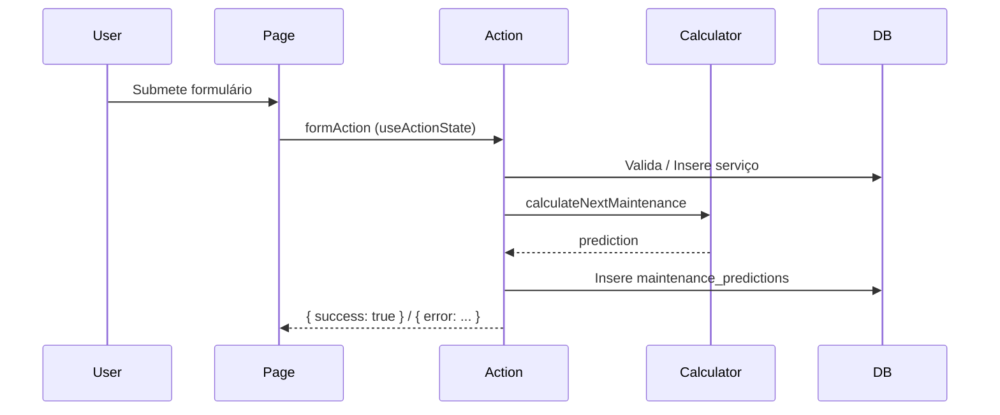

# Codebase Map

> Auto-generated by Cartographer. Last mapped: 2026-09-29T23:03:26Z

## System Overview

Pitstop CRM — sistema de pós-venda para oficinas mecânicas. Foco em retenção de clientes via registro de serviços, previsão de manutenção e contatos via WhatsApp.

```mermaid
graph TB
    Client[UI React (App Router)] --> Actions[Server Actions]
    Actions --> Domain[Domain Logic]
    Actions --> DB[(Supabase)]
    Domain --> DB
    Client --> DB[Supabase Client]
```

**Stack**: Next.js 16.3.6 (App Router), TypeScript (strict), React 19 (`useActionState`), Tailwind CSS, shadcn/ui, Supabase (Postgres + Auth), Playwright (e2e), Zod (validações).

## Directory Structure (Atualizada — 29/09/2026)

- `app/` — App Router (`(auth)/login`, `(dashboard)/`, `clientes/`, `veiculos/`, `servicos/`)
  - `(auth)/login/page.tsx` — Página de login com `useActionState<LoginState, FormData>`
  - `(dashboard)/dashboard/DashboardContent.tsx` — Dashboard com métricas de retenção e contatos
  - `(dashboard)/manutencoes/page.tsx` — Registro de serviço com `useActionState<ActionState, FormData>`
- `app/actions/` — Server Actions
  - `auth.ts` — `login` (`LoginState`, `prevState: LoginState`, `Promise<LoginState>`)
  - `contacts/log.ts`
  - `customers/create.ts` (`prevState: any`, `FormData`)
  - `service-records/create.ts` (`createServiceRecord` com `ActionState`, validação de KM, cálculo de previsão via `calculateNextMaintenance`)
  - `service-records/` — Registro completo de serviço
- `components/` — UI reutilizável (`Button`, `Card`, `MetricCard`, `RetentionSummary`, `ContactStatusBadge`, `ServiceRegistrationFormClient`, `RegisterServiceDialog`)
- `domain/` — Lógica de domínio isolada
  - `maintenance/calculator.ts` (`calculateNextMaintenance`)
  - `maintenance/types.ts`, `service.ts`, `test-calculator.ts` (corrigido `current_km`)
- `lib/` — Utilitários
  - `supabase/client.ts`
  - `supabase/server.ts` (cookies / `next/headers`)
  - `whatsapp.ts` (`generateMaintenanceMessage`)
- `e2e/` — Playwright (`08-ui-polish.spec.ts` corrigido com contexto `aside.filter` e `.first()`)
- `docs/CODEBASE_MAP.md` — Este arquivo (remapeado 2026-09-29)

## Module Guide

### Auth (Login)
- **Arquivos**: `app/actions/auth.ts`, `app/(auth)/login/page.tsx`
- **Tipo**: `LoginState = { error: string | null }`
- **Padrão**: `useActionState<LoginState, FormData>` (React 19 generics)
- **Observação**: `prevState` tipado, `Promise<LoginState>` no retorno

### Service Records (Serviços)
- **Arquivos**: `app/actions/service-records/create.ts`, `components/ServiceRegistrationFormClient.tsx`, `components/RegisterServiceDialog.tsx`
- **Tipo**: `ActionState = { error?: string | null; success?: boolean }`
- **Padrão**: `useActionState<ActionState, FormData>` + `prevState: ActionState`
- **Lógica**: Valida KM > último registro; atualiza `vehicles.current_km`; calcula previsão (`calculateNextMaintenance`) com `serviceType.interval_km`, `current_km`, histórico (`previousServices`); insere `maintenance_predictions` (`UPCOMING`/`CANCELLED`)

### Dashboard
- **Arquivos**: `app/(dashboard)/dashboard/DashboardContent.tsx`, `components/dashboard/metric-card.tsx`, `components/dashboard/retention-summary.tsx`
- **KPIs**: Atrasados, Hoje, Próximos (7 dias), Clientes ativos, Faturamento em Risco (`Number(revenueAtRisk)` corrigido)
- **Retenção**: `retentionRate` calculado por `returnsThisMonth / totalCustomers`
- **Contatos**: `contact_logs` (`action = APPOINTMENT_SCHEDULED`), WhatsApp via `wa.me` com mensagem gerada por `generateMaintenanceMessage`

### Domain — Manutenção
- **Arquivos**: `domain/maintenance/calculator.ts`, `types.ts`, `service.ts`
- **Correção**: `current_km` (não `currentKm`) aplicado em todos os arquivos

### UI / UX Polimento
- **Arquivos**: `e2e/08-ui-polish.spec.ts` (Playwright strict mode — `.first()` para `getByText('Taxa de Retorno')` e contexto `aside.filter({ hasText: 'Retenção' })`)
- **Correções recentes**: `toaster` (`ToastProps` exportado), `DashboardContent` (`value={Number(...)}`), `manutencoes/page.tsx` (generics corrigidos)

## Data Flow (Principais Operações)



## Conventions

- **Nomes**: `camelCase` para variáveis, `PascalCase` para componentes, `snake_case` para colunas no Supabase (ex: `service_type_id`, `current_km`, `interval_km`)
- **Server Actions**: Sempre `prevState` tipado (`any` apenas quando ainda não definido); retorno tipado (`Promise<ActionState>` ou `Promise<void>` via `redirect`)
- **Formulários**: Sempre `useActionState` (React 19) com generics explícitos quando possível; `isPending` usado para estados de carregamento
- **Validação**: Zod no backend (`lib/validations/customer.ts`), não apenas no frontend
- **Dados**: Histórico imutável (`service_records`); previsões são estimativas (`maintenance_predictions` com `status` dinâmico)
- **Cores/UX**: Consultar `docs/checklist-ux.md` antes de qualquer alteração visual; semântica de cores respeitada (`danger` = atrasado, `warning` = janela)

## TypeScript / Build Status (29/09/2026)

- **Erro residual corrigido**: `app/(auth)/login/page.tsx` — overload de `useActionState` resolvido com generics `<LoginState, FormData>`
- **Erro anterior corrigido**: `manutencoes/page.tsx` (`useActionState<ActionState, FormData>`)
- **Build**: `npm run build` — passa (0 erros TypeScript, 0 falhas)
- **Playwright**: `e2e/08-ui-polish.spec.ts` corrigido (strict mode resolvido)
- **Cartographer**: Remapeado (145 arquivos, 119.596 tokens)

## Gotchas (Atualizados)

1. **`useActionState` overload**: Sempre especificar generics (`<State, FormData>`) quando usar com `FormData`; caso contrário TypeScript rejeita devido ao overload de assinatura.
2. **`prevState`**: Server Actions devem aceitar `prevState` como primeiro argumento; não omitir, mesmo que não usado.
3. **`redirect`**: Após `redirect`, não retornar objeto; se precisar de estado, retornar antes do `redirect`.
4. **`current_km`**: Nome correto no banco; `currentKm` não existe mais.
5. **`Number(revenueAtRisk)`**: Corrigido no `DashboardContent` para evitar `value={string}` em `MetricCard`.
6. **Playwright strict mode**: `getByText` com múltiplos matches exige `.first()` ou contexto (`aside.filter`).

## Navigation Guide

**Para adicionar novo tipo de serviço**:
1. Inserir em `service_types` (Supabase)
2. Atualizar `components/ServiceRegistrationFormClient.tsx` (se necessário)

**Para modificar cálculo de manutenção**:
1. `domain/maintenance/calculator.ts`
2. `domain/maintenance/types.ts`
3. Atualizar `service-records/create.ts` (se novos parâmetros necessários)

**Para adicionar nova métrica no dashboard**:
1. `app/(dashboard)/dashboard/DashboardContent.tsx`
2. `components/dashboard/metric-card.tsx` (se novo layout)

**Para corrigir erro Playwright**:
1. Verificar `e2e/*.spec.ts`
2. Aplicar `.first()` ou contexto (`.filter`) para resoluções ambíguas

---
If cartographer helped you, consider starring: https://github.com/kingbootoshi/cartographer - please!
